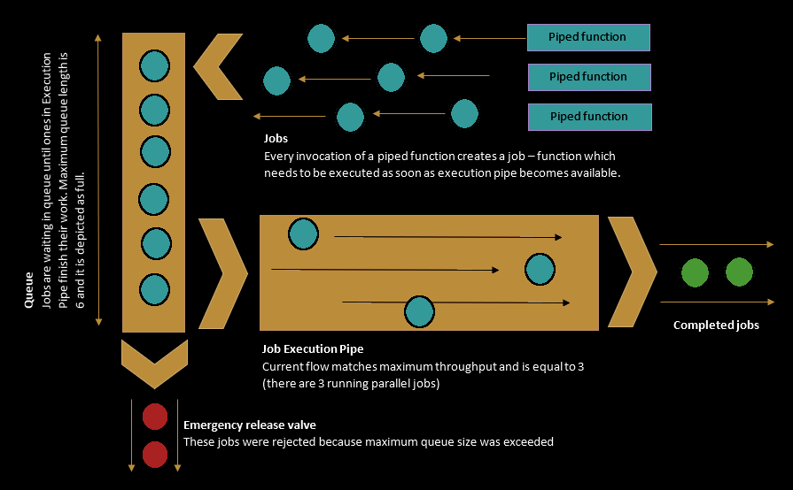

# job-pipe

_by Vytenis Urbonavičius_

Job Pipe provides a simple way to limit parallel executions of one or more JavaScript functions. Parallel execution limit is configurable.

If limit is exceeded, further jobs are queued until a configured maximum queue length is reached. When that limit is exceeded, oldest waiting job is dismissed and new job is added to the queue.

---

## Typical Usage

```javascript
import {createPipe} from 'job-pipe'

const pipe = createPipe()

const foo1 = async () => {
  // Do something asynchronous
}

const foo2 = () =>
  new Promise(resolve => {
    // Do something asynchronous
    resolve(result)
  })

const pipedFoo1 = pipe(foo1)
const pipedFoo2 = pipe(foo2)

const promise1 = pipedFoo1() // Will be executed at once
const promise2 = pipedFoo2() // Will wait for promise1 to resolve

// Below call will reject promise2 with JobPipeQueueExceeded
// and then wait for promise1 before execution
const promise3 = pipedFoo1()
```

---

## Custom Pipe

Pipe can be customized by providing optional pipe properties to _createPipe_ ad object with keys:

| Key          | Default value | Meaning                                                                                                                                                                                                                                                         |
| ------------ | ------------- | --------------------------------------------------------------------------------------------------------------------------------------------------------------------------------------------------------------------------------------------------------------- |
| throughput   | 1             | Maximum amount of parallel executions                                                                                                                                                                                                                           |
| maxQueueSize | 1             | Maximum amount of waiting jobs. If additional job is triggered when queue is full, oldest waiting job will be rejected with _JobPipeQueueExceeded_ exception and new job will be added to the end of queue. For unlimited queue use `{maxQueueSize: Infinity}`. |

**Example:**

```javascript
const pipe = createPipe({
  throughput: 2,
  maxQueueSize: 2,
})
```

---

## Additional API

When pipe is created, there are additional methods attached to the response:

```javascript
const pipe = createPipe()

// Provides amount of jobs which are currently being executed in parallel
pipe.getFlowWidth()

// Provides amount of jobs which are waiting for execution
pipe.getQueueLength()

// Rejects promises of all jobs with JobPipeAborted exception
// Clears the pipe and removes all jobs from queue
pipe.abort()
```

## Thrown Exceptions

| Exception Class      | Meaning                                                                                                               |
| -------------------- | --------------------------------------------------------------------------------------------------------------------- |
| JobPipeError         | Any exception which is handled by _Job Pipe_ is a child of this class. JobPipeError extends default JavaScript Error. |
| JobPipeQueueExceeded | Job is rejected with this exception when it has been cancelled because maximum queue size was exceeded.               |
| JobPipeAborted       | Job is rejected with this exception when whole _Job Pipe_ is manually aborted.                                        |

---

Example of how aborted jobs can be ignored:

```javascript
const pipe = createPipe()

const pipedFn = pipe(someFunction)

try {
  await pipedFn()
} catch (e) {
  if (!(e instanceof JobPipeAborted)) {
    throw e
  }
}
```

---

## Funky Visualization



Happy Hacking!
